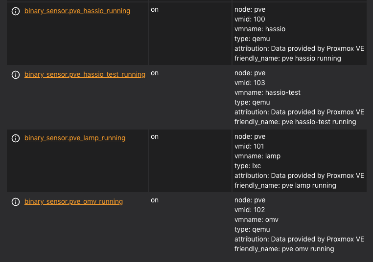

# home-assistant-proxmox-management
A custom Proxmox console on Home Assistant to manage VM &amp; LXC, made with Node-Red.

## Features

 - Get VM & LXC Container info
 - Start VM & LXC
 - Shutdown VM & LXC
 - Reboot VM & LXC
 - Create Snapshot

## Requirements

This components are required for installation:

 - [Official Home Assistant PROXMOX VE integration](https://www.home-assistant.io/integrations/proxmoxve/)  
 - [Custom component Variables](https://github.com/snarky-snark/home-assistant-variables)
 - [Mosquitto broker Add-on](https://github.com/home-assistant/hassio-addons/tree/master/mosquitto) (MQTT)
 - [Node-Red Add-on](https://github.com/hassio-addons/addon-node-red)
 - [Packages configuration](https://www.home-assistant.io/docs/configuration/packages/)
 
 ## Installation

The logic of node-red flows is based on the presence of **binary sensors** created by the **Proxmox VE integration**.

For example, with this configuration you will have **four** binary sensors:

```yaml
proxmoxve:
  - host: 192.168.x.x
    username: hass
    password: fake
    verify_ssl: false
    realm: pve
    nodes:
      - node: pve
        vms:
          - 100
          - 102
          - 103
        containers:
          - 101
```



**Before proceeding with the installation, make sure you've created your Proxmox Binary Sensors and installed/configured all the required components!**

Ok, we can start the installation.

 - Copy **proxmox.yaml** file in your packages directory.
 - Go to Node-Red web interface.
 - If not present, install the follo	wing Node-Red nodes from **Hamburger Icon** -> **Manage palette** -> **Install**
		 - *node-red-contrib-string*
		 - *node-red-contrib-bigssh*
 - Copy this string and import flow from **Hamburger Icon** -> **Import** 
```
[{"id":"dcc0a27e.7303","type":"tab","label":"Proxmox","disabled":false,"info":""},{"id":"440056b9.ac8d38","type":"ha-get-entities","z":"dcc0a27e.7303","server":"926d53a3.e53e1","name":"get Proxmox Sensors","rules":[{"property":"entity_id","logic":"starts_with","value":"binary_sensor.pve","valueType":"str"}],"output_type":"array","output_empty_results":false,"output_location_type":"msg","output_location":"payload","output_results_count":1,"x":340,"y":340,"wires":[["ff416295.32c97"]]},{"id":"2ce18941.2a3066","type":"inject","z":"dcc0a27e.7303","name":"","topic":"","payload":"","payloadType":"date","repeat":"","crontab":"","once":true,"onceDelay":0.1,"x":110,"y":380,"wires":[["440056b9.ac8d38"]]},{"id":"ff416295.32c97","type":"change","z":"dcc0a27e.7303","name":"","rules":[{"t":"set","p":"proxmox","pt":"flow","to":"payload","tot":"msg"}],"action":"","property":"","from":"","to":"","reg":false,"x":590,"y":340,"wires":[["db055972.34a5d8"]]},{"id":"cf1cf492.eab578","type":"api-call-service","z":"dcc0a27e.7303","name":"load Input","server":"926d53a3.e53e1","version":1,"debugenabled":false,"service_domain":"input_select","service":"set_options","entityId":"","data":"","dataType":"json","mergecontext":"","output_location":"payload","output_location_type":"msg","mustacheAltTags":false,"x":1000,"y":340,"wires":[[]]},{"id":"db055972.34a5d8","type":"function","z":"dcc0a27e.7303","name":"get Host List","func":"var sources = flow.get(\"proxmox\");\nvar options = ['Seleziona'];\n\nsources.forEach((obj, i) => {\n    options.push(obj.attributes.vmname);\n});\n\nmsg.payload = {};\nmsg.payload.data = {\n    entity_id : \"input_select.proxmox_vm\",\n    options : options\n}\nreturn msg;\n","outputs":1,"noerr":0,"x":810,"y":340,"wires":[["cf1cf492.eab578"]]},{"id":"1173a60c.ab032a","type":"mqtt in","z":"dcc0a27e.7303","name":"hassio/start","topic":"hassio/start","qos":"2","datatype":"auto","broker":"dca8beaf.9bb41","x":90,"y":320,"wires":[["440056b9.ac8d38"]]},{"id":"77b3f600.f486c8","type":"server-state-changed","z":"dcc0a27e.7303","name":"event Sensor Change","server":"926d53a3.e53e1","version":1,"exposeToHomeAssistant":false,"haConfig":[{"property":"name","value":""},{"property":"icon","value":""}],"entityidfilter":"binary_sensor.pve","entityidfiltertype":"substring","outputinitially":false,"state_type":"str","haltifstate":"","halt_if_type":"str","halt_if_compare":"is","outputs":1,"output_only_on_state_change":true,"x":120,"y":600,"wires":[["ac07c405.5bb3c8"]]},{"id":"ac07c405.5bb3c8","type":"function","z":"dcc0a27e.7303","name":"check Selected Host","func":"const globalHomeAssistant = global.get('homeassistant');\nvar entity_id = msg.topic;\nvar attribute = 'vmname';\nvmname = globalHomeAssistant.homeAssistant.states[entity_id].attributes[attribute];\nselected_host = globalHomeAssistant.homeAssistant.states['input_select.proxmox_vm'].state;\nmsg.reload_status = (vmname == selected_host);\nreturn msg;","outputs":1,"noerr":0,"x":380,"y":600,"wires":[["65e5f15a.5a20c"]]},{"id":"65e5f15a.5a20c","type":"switch","z":"dcc0a27e.7303","name":"need reload status?","property":"reload_status","propertyType":"msg","rules":[{"t":"true"}],"checkall":"true","repair":false,"outputs":1,"x":660,"y":611,"wires":[["3e6afac.dc4ab06"]]},{"id":"3e6afac.dc4ab06","type":"switch","z":"dcc0a27e.7303","name":"On o Off?","property":"payload","propertyType":"msg","rules":[{"t":"eq","v":"on","vt":"str"},{"t":"eq","v":"off","vt":"str"}],"checkall":"true","repair":false,"outputs":2,"x":880,"y":611,"wires":[["e361c176.e7869"],["2450638a.8aa9ec"]]},{"id":"e361c176.e7869","type":"api-call-service","z":"dcc0a27e.7303","name":"Status On","server":"926d53a3.e53e1","version":1,"debugenabled":false,"service_domain":"var","service":"set","entityId":"","data":"{\"entity_id\":\"var.proxmox_status\",\"value\":\"Running\"}","dataType":"json","mergecontext":"","output_location":"","output_location_type":"none","mustacheAltTags":false,"x":1060,"y":571,"wires":[[]]},{"id":"2450638a.8aa9ec","type":"api-call-service","z":"dcc0a27e.7303","name":"Status Off","server":"926d53a3.e53e1","version":1,"debugenabled":false,"service_domain":"var","service":"set","entityId":"","data":"{\"entity_id\":\"var.proxmox_status\",\"value\":\"Stopped\"}","dataType":"json","mergecontext":"","output_location":"","output_location_type":"none","mustacheAltTags":false,"x":1060,"y":651,"wires":[[]]},{"id":"7672b922.2eedd8","type":"comment","z":"dcc0a27e.7303","name":"Setta la variabile STATUS (se necessario) al cambio stato host","info":"","x":240,"y":531,"wires":[]},{"id":"615dec2.1d73314","type":"comment","z":"dcc0a27e.7303","name":"Popola la lista degli HOST all'avvio di Home Assistant","info":"","x":220,"y":260,"wires":[]},{"id":"4071d9df.1d4378","type":"comment","z":"dcc0a27e.7303","name":"Selezione HOST da UI","info":"","x":120,"y":820,"wires":[]},{"id":"85620dd2.23313","type":"comment","z":"dcc0a27e.7303","name":"Functions","info":"","x":80,"y":40,"wires":[]},{"id":"9fd9339b.5f122","type":"link in","z":"dcc0a27e.7303","name":"var Log","links":["e835236.e50dce","da4f0926.becc08","81d0897f.1ebbe8","c0f48284.92b0b","2744bd8.2f69642","e7342b33.5fd618","1e271a62.7fe2b6","598a9381.48e80c","7883d3cc.ad86bc","b4bd7e83.ffdc7","2dd680d1.05941","8f03b828.1beba8","fafcaa48.a9d8f8","653ce2f8.0428ec","da60ecb.c53281","5c93af5f.529d","54b23884.cdfc28","55b07101.c7239","c57f2465.af1d68","b922b39d.9a9a6","40246249.42648c","aa60a2bd.65c89","dbfe09fb.6f0758","c69c788c.b20f78","56344900.97f2a8","609b34fd.2cdb4c","5493b9f3.310cb8","f28a8bf9.9080d8","57588b0b.3d9724","e9694a9a.6619d8","8b3d7c05.9ab23","2a823276.f4926e","c0a9fb0b.1cc5b8","5fc39b44.9cedd4","b0d76136.e6d27","662ba526.42964c","cc2b5a1a.eb4c68","5cae7652.85eb78","167d5eb1.76a331"],"x":70,"y":120,"wires":[["7389f4c3.dbefcc","1c7dbf77.c8c491"]],"l":true},{"id":"7389f4c3.dbefcc","type":"function","z":"dcc0a27e.7303","name":"set Data","func":"msg.payload = {};\nmsg.payload.data = {\n    entity_id : \"var.proxmox_last_command\",\n    value: msg.type\n}\nreturn msg;\n","outputs":1,"noerr":0,"x":240,"y":80,"wires":[["4a8fc44b.ace03c"]]},{"id":"1c7dbf77.c8c491","type":"function","z":"dcc0a27e.7303","name":"set Data","func":"msg.payload = {};\nmsg.payload.data = {\n    entity_id : \"var.proxmox_log\",\n    value: msg.message\n}\nreturn msg;\n","outputs":1,"noerr":0,"x":240,"y":160,"wires":[["4a8fc44b.ace03c","5bd5614.e2ab3a"]]},{"id":"4a8fc44b.ace03c","type":"api-call-service","z":"dcc0a27e.7303","name":"write Log","server":"926d53a3.e53e1","version":1,"debugenabled":false,"service_domain":"var","service":"set","entityId":"","data":"","dataType":"json","mergecontext":"","output_location":"","output_location_type":"none","mustacheAltTags":false,"x":440,"y":80,"wires":[[]]},{"id":"1745a84c.d11168","type":"mqtt in","z":"dcc0a27e.7303","name":"proxmox/command","topic":"proxmox/command","qos":"2","datatype":"auto","broker":"dca8beaf.9bb41","x":110,"y":2380,"wires":[["b3229.87e6fdd78"]]},{"id":"4e010ab8.857e64","type":"function","z":"dcc0a27e.7303","name":"prepare command","func":"var command = \"\";\nvar process = \"\";\nswitch(msg.vmtype) {\n  case \"qemu\":\n    process = \"qm\";\n    break;\n  case \"lxc\":\n    process = \"pct\";\n    break;\n  default:\n\n}\n//process = \"aaa\";\ncommand = process + \" \" + msg.payload.command + \" \" + msg.vmid;\n\nif (msg.payload.command===\"snapshot\")\n{\n    command = command + \" \" + msg.snapshotname;\n}\n\nmsg.payload = command;\n\n//msg.vmid = result.attributes.vmid;\n//msg.vmtype = result.attributes.type;\n//msg.vmname = selected_host;\n//msg.command = msg.payload;\n\nreturn msg;","outputs":1,"noerr":0,"x":1270,"y":2380,"wires":[["8417fad8.6bff68","8e8f6732.729d98"]]},{"id":"8e8f6732.729d98","type":"bigssh","z":"dcc0a27e.7303","name":"ssh","commandLine":"","commandArgs":"","minError":1,"minWarning":1,"noStdin":false,"format":"utf8","payloadIsArg":true,"myssh":"830d322f.c34b5","x":1470,"y":2380,"wires":[[],["58a2293e.f369f8"],["1d6d3e41.247902"]]},{"id":"58a2293e.f369f8","type":"switch","z":"dcc0a27e.7303","name":"End command?","property":"control.state","propertyType":"msg","rules":[{"t":"eq","v":"end","vt":"str"}],"checkall":"true","repair":false,"outputs":1,"x":1680,"y":2280,"wires":[["b1000103.c64f8","65294160.97919"]]},{"id":"1d6d3e41.247902","type":"function","z":"dcc0a27e.7303","name":"set Log","func":"var command = flow.get(\"command\");\nmsg.type = \"error\";\nmsg.message = \"[\"+command+\"] ERROR: \"+ msg.payload;\nreturn msg;\n","outputs":1,"noerr":0,"x":1660,"y":2460,"wires":[["2dd680d1.05941"]]},{"id":"2dd680d1.05941","type":"link out","z":"dcc0a27e.7303","name":"\"Error\"","links":["9fd9339b.5f122"],"x":1830,"y":2460,"wires":[],"l":true},{"id":"b1000103.c64f8","type":"function","z":"dcc0a27e.7303","name":"set Log","func":"var command = flow.get(\"command\");\nmsg.type = \"success\";\nif (command==\"snapshot\")\n{\n    msg.message = \"[\"+command+\"] Completed!\";\n} else {\n    msg.message = \"[\"+command+\"] Completed!<br>Wait for sensors update.\";\n}\n\nreturn msg;\n","outputs":1,"noerr":0,"x":1680,"y":2340,"wires":[["8f03b828.1beba8"]]},{"id":"8f03b828.1beba8","type":"link out","z":"dcc0a27e.7303","name":"\"Log Success\"","links":["9fd9339b.5f122"],"x":1880,"y":2340,"wires":[],"l":true},{"id":"5ca1616.517aba","type":"switch","z":"dcc0a27e.7303","name":"Snapshot?","property":"payload.command","propertyType":"msg","rules":[{"t":"eq","v":"snapshot","vt":"str"},{"t":"neq","v":"snapshot","vt":"str"}],"checkall":"true","repair":false,"outputs":2,"x":790,"y":2380,"wires":[["fdd39b31.183c48"],["4e010ab8.857e64"]]},{"id":"fdd39b31.183c48","type":"function","z":"dcc0a27e.7303","name":"check Snapshot name","func":"const globalHomeAssistant = global.get('homeassistant');\n\nstate = globalHomeAssistant.homeAssistant.states['input_text.proxmox_snapshot'].state;\nstate = state.split(' ').join('_');\nmsg.snapshotname = state;\nmsg.check = (state===\"\") ? false : true;\n\nreturn msg;","outputs":1,"noerr":0,"x":1000,"y":2240,"wires":[["2e15babd.95db96"]]},{"id":"2e15babd.95db96","type":"switch","z":"dcc0a27e.7303","name":"Continue?","property":"check","propertyType":"msg","rules":[{"t":"true"},{"t":"false"}],"checkall":"true","repair":false,"outputs":2,"x":1010,"y":2300,"wires":[["4e010ab8.857e64"],["581eb4eb.75be4c"]]},{"id":"581eb4eb.75be4c","type":"function","z":"dcc0a27e.7303","name":"set Log","func":"msg.type = \"warning\";\nmsg.message = \"WARNING: Snapshot name is required\"\nreturn msg;\n","outputs":1,"noerr":0,"x":980,"y":2520,"wires":[["fafcaa48.a9d8f8"]]},{"id":"fafcaa48.a9d8f8","type":"link out","z":"dcc0a27e.7303","name":"\"Snapshot name missing\"","links":["9fd9339b.5f122"],"x":1190,"y":2520,"wires":[],"l":true},{"id":"8417fad8.6bff68","type":"function","z":"dcc0a27e.7303","name":"set Log","func":"var command = flow.get(\"command\");\nmsg.type = \"info\";\nmsg.message = \"[\"+command+\"] Running Command ...\";\nreturn msg;\n","outputs":1,"noerr":0,"x":1420,"y":2300,"wires":[["da60ecb.c53281"]]},{"id":"da60ecb.c53281","type":"link out","z":"dcc0a27e.7303","name":"Running","links":["9fd9339b.5f122"],"x":1420,"y":2240,"wires":[],"l":true},{"id":"4f71268.df31ad8","type":"change","z":"dcc0a27e.7303","name":"flow variable","rules":[{"t":"set","p":"command","pt":"flow","to":"payload.command","tot":"msg"},{"t":"set","p":"host","pt":"flow","to":"payload.host","tot":"msg"}],"action":"","property":"","from":"","to":"","reg":false,"x":310,"y":2460,"wires":[[]]},{"id":"f3923724.336d58","type":"mqtt in","z":"dcc0a27e.7303","name":"proxmox/config","topic":"proxmox/config","qos":"2","datatype":"auto","broker":"dca8beaf.9bb41","x":100,"y":1620,"wires":[["930a8e87.44732"]]},{"id":"930a8e87.44732","type":"function","z":"dcc0a27e.7303","name":"prepare message","func":"const host = msg.payload;\n\nvar proxmox = flow.get(\"proxmox\");\n\nvar result = proxmox.find(obj => {\n  return obj.attributes.vmname === host\n})\n\nmsg.vmname = host;\n\nif (result===undefined)\n{\n    msg.hostvalid = false;    \n} else {\n    msg.hostvalid = true;    \n    msg.vmid = result.attributes.vmid;\n    msg.vmtype = result.attributes.type;\n}\n\nreturn msg;","outputs":1,"noerr":0,"x":310,"y":1620,"wires":[["1d2ccf8b.7282"]]},{"id":"79e6cc88.9bea54","type":"function","z":"dcc0a27e.7303","name":"prepare command","func":"var command = \"\";\nvar process = \"\";\nswitch(msg.vmtype) {\n  case \"qemu\":\n    process = \"qm\";\n    break;\n  case \"lxc\":\n    process = \"pct\";\n    break;\n  default:\n\n}\n\ncommand = process + \" config \" + msg.vmid;\n\nmsg.payload = command;\n\nreturn msg;","outputs":1,"noerr":0,"x":790,"y":1620,"wires":[["f15e7c7d.b9284"]]},{"id":"c1d827d2.d6c2c8","type":"split","z":"dcc0a27e.7303","name":"","splt":"\\n","spltType":"str","arraySplt":1,"arraySpltType":"len","stream":false,"addname":"","x":1270,"y":1620,"wires":[["c1e9c407.bed568"]]},{"id":"c1e9c407.bed568","type":"function","z":"dcc0a27e.7303","name":"create array","func":"var str = msg.payload;\nvar res = str.split(\": \");\nmsg.payload = res;\nreturn msg;\n","outputs":1,"noerr":0,"x":1310,"y":1700,"wires":[["7dd376fc.475688"]]},{"id":"7dd376fc.475688","type":"switch","z":"dcc0a27e.7303","name":"Get info","property":"payload[0]","propertyType":"msg","rules":[{"t":"eq","v":"cores","vt":"str"},{"t":"eq","v":"memory","vt":"str"}],"checkall":"true","repair":false,"outputs":2,"x":1300,"y":1760,"wires":[["484af639.58f0d8"],["eaf7d916.fd59c8"]]},{"id":"29c9372c.bdee68","type":"api-call-service","z":"dcc0a27e.7303","name":"set var","server":"926d53a3.e53e1","version":1,"debugenabled":false,"service_domain":"var","service":"set","entityId":"","data":"","dataType":"json","mergecontext":"","output_location":"","output_location_type":"none","mustacheAltTags":false,"x":1790,"y":1740,"wires":[[]]},{"id":"484af639.58f0d8","type":"function","z":"dcc0a27e.7303","name":"set CORES","func":"var value = msg.payload[1];\nmsg.payload = {};\nmsg.payload.data = {\n    entity_id : \"var.proxmox_cores\",\n    value : value\n}\nreturn msg;","outputs":1,"noerr":0,"x":1530,"y":1720,"wires":[["29c9372c.bdee68"]]},{"id":"eaf7d916.fd59c8","type":"function","z":"dcc0a27e.7303","name":"set MEMORY","func":"var value = msg.payload[1];\nmsg.payload = {};\nmsg.payload.data = {\n    entity_id : \"var.proxmox_memory\",\n    value : value\n}\nreturn msg;","outputs":1,"noerr":0,"x":1540,"y":1780,"wires":[["29c9372c.bdee68"]]},{"id":"f15e7c7d.b9284","type":"bigssh","z":"dcc0a27e.7303","name":"ssh","commandLine":"","commandArgs":"","minError":1,"minWarning":1,"noStdin":false,"format":"utf8","payloadIsArg":true,"myssh":"830d322f.c34b5","x":1030,"y":1620,"wires":[["c1d827d2.d6c2c8","d2bb300a.cb165","79150345.7c1cec"],[],["d003f13c.b73cb"]]},{"id":"d003f13c.b73cb","type":"function","z":"dcc0a27e.7303","name":"set Log","func":"var command = flow.get(\"command\");\nmsg.type = \"error\";\nmsg.message = \"[\"+command+\"] ERROR: \"+ msg.payload;\nreturn msg;\n","outputs":1,"noerr":0,"x":1220,"y":1860,"wires":[["609b34fd.2cdb4c"]]},{"id":"609b34fd.2cdb4c","type":"link out","z":"dcc0a27e.7303","name":"\"Error\"","links":["9fd9339b.5f122"],"x":1410,"y":1860,"wires":[],"l":true},{"id":"b892c0ef.48538","type":"server-state-changed","z":"dcc0a27e.7303","name":"Selezione Host","server":"926d53a3.e53e1","version":1,"exposeToHomeAssistant":false,"haConfig":[{"property":"name","value":""},{"property":"icon","value":""}],"entityidfilter":"input_select.proxmox_vm","entityidfiltertype":"exact","outputinitially":false,"state_type":"str","haltifstate":"Seleziona","halt_if_type":"str","halt_if_compare":"is_not","outputs":2,"output_only_on_state_change":true,"x":100,"y":1020,"wires":[["bac783b9.51ebd","874eeb48.8f6b18","c56140c8.9b674","6a648ba0.3eca34","54a1e781.7ec2a8","25ff8dff.8161e2"],["f09b44ca.d449d8"]]},{"id":"bac783b9.51ebd","type":"mqtt out","z":"dcc0a27e.7303","name":"","topic":"proxmox/config","qos":"","retain":"","broker":"dca8beaf.9bb41","x":360,"y":1020,"wires":[]},{"id":"f0b90729.185848","type":"ha-get-entities","z":"dcc0a27e.7303","server":"926d53a3.e53e1","name":"get entity","rules":[{"property":"attributes.vmname","logic":"is","value":"vmname","valueType":"msg"}],"output_type":"array","output_empty_results":false,"output_location_type":"msg","output_location":"payload","output_results_count":1,"x":520,"y":1420,"wires":[["7c994e16.fa22d"]]},{"id":"7c994e16.fa22d","type":"function","z":"dcc0a27e.7303","name":"set STATUS","func":"var status = msg.payload[0].state\nstatus = (status===\"on\") ? \"Running\" : \"Stopped\";\nmsg.payload = {};\nmsg.payload.data = {\n    entity_id : \"var.proxmox_status\",\n    value : status\n}\nreturn msg;\n\n","outputs":1,"noerr":0,"x":730,"y":1420,"wires":[["3b8186ab.7a899a"]]},{"id":"3b8186ab.7a899a","type":"api-call-service","z":"dcc0a27e.7303","name":"set var","server":"926d53a3.e53e1","version":1,"debugenabled":false,"service_domain":"var","service":"set","entityId":"","data":"","dataType":"json","mergecontext":"","output_location":"","output_location_type":"none","mustacheAltTags":false,"x":910,"y":1460,"wires":[[]]},{"id":"b8afe4c8.99d978","type":"function","z":"dcc0a27e.7303","name":"set NAME","func":"var name = msg.vmname;\nmsg.payload = {};\nmsg.payload.data = {\n    entity_id : \"var.proxmox_name\",\n    value : name\n}\nreturn msg;\n\n","outputs":1,"noerr":0,"x":720,"y":1460,"wires":[["3b8186ab.7a899a"]]},{"id":"7d04c81c.fbdcb8","type":"function","z":"dcc0a27e.7303","name":"set ID","func":"var id = msg.vmid;\nmsg.payload = {};\nmsg.payload.data = {\n    entity_id : \"var.proxmox_id\",\n    value : id\n}\nreturn msg;\n\n","outputs":1,"noerr":0,"x":710,"y":1500,"wires":[["3b8186ab.7a899a"]]},{"id":"dc550707.acf8c8","type":"function","z":"dcc0a27e.7303","name":"set TYPE","func":"var type = (msg.vmtype===\"qemu\") ? \"VM\" : \"LXC\";\nmsg.payload = {};\nmsg.payload.data = {\n    entity_id : \"var.proxmox_type\",\n    value : type\n}\nreturn msg;","outputs":1,"noerr":0,"x":720,"y":1540,"wires":[["3b8186ab.7a899a"]]},{"id":"f09b44ca.d449d8","type":"ha-get-entities","z":"dcc0a27e.7303","server":"926d53a3.e53e1","name":"get Variables","rules":[{"property":"entity_id","logic":"starts_with","value":"var.proxmox_","valueType":"str"}],"output_type":"array","output_empty_results":false,"output_location_type":"msg","output_location":"payload","output_results_count":1,"x":350,"y":1100,"wires":[["bf1e0e5d.cd875"]]},{"id":"bf1e0e5d.cd875","type":"split","z":"dcc0a27e.7303","name":"","splt":"\\n","spltType":"str","arraySplt":1,"arraySpltType":"len","stream":false,"addname":"","x":530,"y":1100,"wires":[["40de521f.75a06c"]]},{"id":"40de521f.75a06c","type":"function","z":"dcc0a27e.7303","name":"clean variable","func":"var entity = msg.payload.entity_id;\nmsg.payload = {};\nmsg.payload.data = {\n    entity_id : entity,\n    value : ''\n}\nreturn msg;\n\n","outputs":1,"noerr":0,"x":720,"y":1100,"wires":[["8ea768e3.3fef38"]]},{"id":"8ea768e3.3fef38","type":"api-call-service","z":"dcc0a27e.7303","name":"set var","server":"926d53a3.e53e1","version":1,"debugenabled":false,"service_domain":"var","service":"set","entityId":"","data":"","dataType":"json","mergecontext":"","output_location":"","output_location_type":"none","mustacheAltTags":false,"x":910,"y":1100,"wires":[[]]},{"id":"874eeb48.8f6b18","type":"api-call-service","z":"dcc0a27e.7303","name":"loading memory","server":"926d53a3.e53e1","version":1,"debugenabled":false,"service_domain":"var","service":"set","entityId":"","data":"{\"entity_id\":\"var.proxmox_memory\",\"value\":\"Loading ...\"}","dataType":"json","mergecontext":"","output_location":"","output_location_type":"none","mustacheAltTags":false,"x":360,"y":900,"wires":[[]]},{"id":"c56140c8.9b674","type":"api-call-service","z":"dcc0a27e.7303","name":"loading cores","server":"926d53a3.e53e1","version":1,"debugenabled":false,"service_domain":"var","service":"set","entityId":"","data":"{\"entity_id\":\"var.proxmox_cores\",\"value\":\"Loading ...\"}","dataType":"json","mergecontext":"","output_location":"","output_location_type":"none","mustacheAltTags":false,"x":360,"y":960,"wires":[[]]},{"id":"d2bb300a.cb165","type":"string","z":"dcc0a27e.7303","name":"cores?","methods":[{"name":"contains","params":[{"type":"str","value":"cores"}]}],"prop":"payload","propout":"payload","object":"msg","objectout":"msg","x":1270,"y":1540,"wires":[["23f0deca.86f892"]]},{"id":"c95276fe.d5cf98","type":"function","z":"dcc0a27e.7303","name":"set CORES","func":"msg.payload = {};\nmsg.payload.data = {\n    entity_id : \"var.proxmox_cores\",\n    value : \"unvailable\"\n}\nreturn msg;","outputs":1,"noerr":0,"x":1580,"y":1540,"wires":[["6953704b.34325"]]},{"id":"6953704b.34325","type":"api-call-service","z":"dcc0a27e.7303","name":"set var","server":"926d53a3.e53e1","version":1,"debugenabled":false,"service_domain":"var","service":"set","entityId":"","data":"","dataType":"json","mergecontext":"","output_location":"","output_location_type":"none","mustacheAltTags":false,"x":1740,"y":1540,"wires":[[]]},{"id":"23f0deca.86f892","type":"switch","z":"dcc0a27e.7303","name":"false?","property":"payload","propertyType":"msg","rules":[{"t":"false"}],"checkall":"true","repair":false,"outputs":1,"x":1420,"y":1540,"wires":[["c95276fe.d5cf98"]]},{"id":"79150345.7c1cec","type":"string","z":"dcc0a27e.7303","name":"memory?","methods":[{"name":"contains","params":[{"type":"str","value":"memory"}]}],"prop":"payload","propout":"payload","object":"msg","objectout":"msg","x":1280,"y":1480,"wires":[["b1f83c49.5047f"]]},{"id":"b1f83c49.5047f","type":"switch","z":"dcc0a27e.7303","name":"false?","property":"payload","propertyType":"msg","rules":[{"t":"false"}],"checkall":"true","repair":false,"outputs":1,"x":1430,"y":1480,"wires":[["30a4b1f1.63308e"]]},{"id":"30a4b1f1.63308e","type":"function","z":"dcc0a27e.7303","name":"set MEMORY","func":"msg.payload = {};\nmsg.payload.data = {\n    entity_id : \"var.proxmox_memory\",\n    value : \"unvailable\"\n}\nreturn msg;","outputs":1,"noerr":0,"x":1600,"y":1480,"wires":[["3579d769.14bb08"]]},{"id":"3579d769.14bb08","type":"api-call-service","z":"dcc0a27e.7303","name":"set var","server":"926d53a3.e53e1","version":1,"debugenabled":false,"service_domain":"var","service":"set","entityId":"","data":"","dataType":"json","mergecontext":"","output_location":"","output_location_type":"none","mustacheAltTags":false,"x":1750,"y":1480,"wires":[[]]},{"id":"1dcad943.038407","type":"comment","z":"dcc0a27e.7303","name":"Get Config","info":"","x":80,"y":1560,"wires":[]},{"id":"47b91416.a1389c","type":"comment","z":"dcc0a27e.7303","name":"Get lista snapshot","info":"","x":130,"y":2760,"wires":[]},{"id":"cf9273be.55158","type":"mqtt in","z":"dcc0a27e.7303","name":"proxmox/listsnapshot","topic":"proxmox/listsnapshot","qos":"2","datatype":"auto","broker":"dca8beaf.9bb41","x":140,"y":2960,"wires":[["5e146583.2d556c","7d02e60c.2f91d8"]]},{"id":"ed9cbfbc.0039d","type":"function","z":"dcc0a27e.7303","name":"prepare command","func":"var command = \"\";\nvar process = \"\";\nswitch(msg.vmtype) {\n  case \"qemu\":\n    process = \"qm\";\n    break;\n  case \"lxc\":\n    process = \"pct\";\n    break;\n  default:\n\n}\n\ncommand = process + \" listsnapshot \" + msg.vmid;\n\nmsg.payload = command;\n\nreturn msg;","outputs":1,"noerr":0,"x":610,"y":2980,"wires":[["56ca94c6.73aeec"]]},{"id":"56ca94c6.73aeec","type":"bigssh","z":"dcc0a27e.7303","name":"ssh","commandLine":"","commandArgs":"","minError":1,"minWarning":1,"noStdin":false,"format":"utf8","payloadIsArg":true,"myssh":"830d322f.c34b5","x":830,"y":2960,"wires":[["b5625ea3.eb234"],[],["1bd30bb1.77dc14"]]},{"id":"b5625ea3.eb234","type":"split","z":"dcc0a27e.7303","name":"","splt":"\\n","spltType":"str","arraySplt":1,"arraySpltType":"len","stream":false,"addname":"","x":1030,"y":2940,"wires":[["37d0bb0.3659e46"]]},{"id":"d34be46d.e19108","type":"string","z":"dcc0a27e.7303","name":"get Snapshot Name","methods":[{"name":"delLeftMost","params":[{"type":"str","value":"-> "}]},{"name":"getLeftMost","params":[{"type":"str","value":" "}]}],"prop":"payload","propout":"payload","object":"msg","objectout":"msg","x":1380,"y":3000,"wires":[["40fc624e.6adadc"]]},{"id":"40fc624e.6adadc","type":"switch","z":"dcc0a27e.7303","name":"","property":"payload","propertyType":"msg","rules":[{"t":"neq","v":"current","vt":"str"}],"checkall":"true","repair":true,"outputs":1,"x":1590,"y":3000,"wires":[["af14b924.91d668"]]},{"id":"d7557c89.ee114","type":"join","z":"dcc0a27e.7303","name":"","mode":"custom","build":"string","property":"payload","propertyType":"msg","key":"topic","joiner":"<br>","joinerType":"str","accumulate":false,"timeout":"","count":"","reduceRight":false,"reduceExp":"","reduceInit":"","reduceInitType":"num","reduceFixup":"","x":1590,"y":3120,"wires":[["5bb72f07.ef723"]]},{"id":"5bb72f07.ef723","type":"function","z":"dcc0a27e.7303","name":"set Data","func":"\nvar snap_list = msg.payload;\nmsg.payload = {};\nmsg.payload.data = {\n    entity_id : \"var.proxmox_snapshots\",\n    value : snap_list\n}\nreturn msg;\n\n","outputs":1,"noerr":0,"x":1740,"y":3120,"wires":[["dd9df712.fd1498"]]},{"id":"dd9df712.fd1498","type":"api-call-service","z":"dcc0a27e.7303","name":"set var","server":"926d53a3.e53e1","version":1,"debugenabled":false,"service_domain":"var","service":"set","entityId":"","data":"","dataType":"json","mergecontext":"","output_location":"","output_location_type":"none","mustacheAltTags":false,"x":1890,"y":3120,"wires":[[]]},{"id":"3987c647.4eac3a","type":"mqtt out","z":"dcc0a27e.7303","name":"","topic":"proxmox/listsnapshot","qos":"","retain":"","broker":"dca8beaf.9bb41","x":600,"y":840,"wires":[]},{"id":"6a648ba0.3eca34","type":"api-call-service","z":"dcc0a27e.7303","name":"loading snapshots","server":"926d53a3.e53e1","version":1,"debugenabled":false,"service_domain":"var","service":"set","entityId":"","data":"{\"entity_id\":\"var.proxmox_snapshots\",\"value\":\"Loading ...\"}","dataType":"json","mergecontext":"","output_location":"","output_location_type":"none","mustacheAltTags":false,"x":370,"y":840,"wires":[["3987c647.4eac3a"]]},{"id":"65294160.97919","type":"switch","z":"dcc0a27e.7303","name":"Snapshot?","property":"command","propertyType":"flow","rules":[{"t":"eq","v":"snapshot","vt":"str"}],"checkall":"true","repair":false,"outputs":1,"x":1890,"y":2220,"wires":[["2e7faf58.30bf4"]]},{"id":"2e7faf58.30bf4","type":"api-call-service","z":"dcc0a27e.7303","name":"loading snapshots","server":"926d53a3.e53e1","version":1,"debugenabled":false,"service_domain":"var","service":"set","entityId":"","data":"{\"entity_id\":\"var.proxmox_snapshots\",\"value\":\"Loading ...\"}","dataType":"json","mergecontext":"","output_location":"","output_location_type":"none","mustacheAltTags":false,"x":2110,"y":2220,"wires":[["a28bd9cd.cbefc8"]]},{"id":"60ae965d.238338","type":"mqtt out","z":"dcc0a27e.7303","name":"","topic":"proxmox/listsnapshot","qos":"","retain":"","broker":"dca8beaf.9bb41","x":2340,"y":2300,"wires":[]},{"id":"a28bd9cd.cbefc8","type":"change","z":"dcc0a27e.7303","name":"","rules":[{"t":"set","p":"payload","pt":"msg","to":"host","tot":"flow"}],"action":"","property":"","from":"","to":"","reg":false,"x":2120,"y":2300,"wires":[["60ae965d.238338"]]},{"id":"54a1e781.7ec2a8","type":"function","z":"dcc0a27e.7303","name":"set Log","func":"msg.type = \"waiting\";\nmsg.message = \"Waiting Command ...\"\nreturn msg;\n","outputs":1,"noerr":0,"x":340,"y":1180,"wires":[["8b3d7c05.9ab23"]]},{"id":"8b3d7c05.9ab23","type":"link out","z":"dcc0a27e.7303","name":"\"Waiting\"","links":["9fd9339b.5f122"],"x":520,"y":1180,"wires":[],"l":true},{"id":"37d0bb0.3659e46","type":"switch","z":"dcc0a27e.7303","name":"clean null","property":"payload","propertyType":"msg","rules":[{"t":"nempty"}],"checkall":"true","repair":true,"outputs":1,"x":1180,"y":2940,"wires":[["656b1bad.807f74","d34be46d.e19108"]]},{"id":"af14b924.91d668","type":"string","z":"dcc0a27e.7303","name":"add \"-\"","methods":[{"name":"ensureLeft","params":[{"type":"str","value":"- "}]}],"prop":"payload","propout":"payload","object":"msg","objectout":"msg","x":1600,"y":3060,"wires":[["d7557c89.ee114"]]},{"id":"656b1bad.807f74","type":"join","z":"dcc0a27e.7303","name":"create array","mode":"custom","build":"array","property":"payload","propertyType":"msg","key":"topic","joiner":"\\n","joinerType":"str","accumulate":false,"timeout":"","count":"","reduceRight":false,"reduceExp":"","reduceInit":"","reduceInitType":"","reduceFixup":"","x":1410,"y":2820,"wires":[["6fbfd547.7cec9c"]]},{"id":"6fbfd547.7cec9c","type":"switch","z":"dcc0a27e.7303","name":"count array","property":"$count(msg.payload)","propertyType":"jsonata","rules":[{"t":"eq","v":"1","vt":"str"},{"t":"gt","v":"1","vt":"str"}],"checkall":"true","repair":true,"outputs":2,"x":1410,"y":2880,"wires":[["17dfa718.e07199"],[]]},{"id":"17dfa718.e07199","type":"function","z":"dcc0a27e.7303","name":"No Snashots","func":"msg.payload = {};\nmsg.payload.data = {\n    entity_id : \"var.proxmox_snapshots\",\n    value : \"No Snapshots Found\"\n}\nreturn msg;\n\n","outputs":1,"noerr":0,"x":1610,"y":2880,"wires":[["5864336e.4bb56c"]]},{"id":"5864336e.4bb56c","type":"api-call-service","z":"dcc0a27e.7303","name":"set var","server":"926d53a3.e53e1","version":1,"debugenabled":false,"service_domain":"var","service":"set","entityId":"","data":"","dataType":"json","mergecontext":"","output_location":"","output_location_type":"none","mustacheAltTags":false,"x":1790,"y":2880,"wires":[[]]},{"id":"25ff8dff.8161e2","type":"api-call-service","z":"dcc0a27e.7303","name":"clean Snapshot name","server":"926d53a3.e53e1","version":1,"debugenabled":false,"service_domain":"input_text","service":"set_value","entityId":"input_text.proxmox_snapshot","data":"{\"value\" : \"\"} ","dataType":"json","mergecontext":"","output_location":"","output_location_type":"none","mustacheAltTags":false,"x":380,"y":1240,"wires":[[]]},{"id":"cf5694f7.0f5988","type":"comment","z":"dcc0a27e.7303","name":"Esegui comando","info":"","x":100,"y":2300,"wires":[]},{"id":"a4092e15.983ee","type":"api-current-state","z":"dcc0a27e.7303","name":"notify Enabled?","server":"926d53a3.e53e1","version":1,"outputs":2,"halt_if":"on","halt_if_type":"str","halt_if_compare":"is","override_topic":false,"entity_id":"input_boolean.proxmox_notifiche","state_type":"str","state_location":"payload","override_payload":"msg","entity_location":"data","override_data":"msg","blockInputOverrides":false,"x":700,"y":100,"wires":[["851df3f3.5c74a"],[]]},{"id":"a961ca76.42fa28","type":"api-call-service","z":"dcc0a27e.7303","name":"Notify","server":"926d53a3.e53e1","version":1,"debugenabled":false,"service_domain":"persistent_notification","service":"create","entityId":"","data":"","dataType":"json","mergecontext":"","output_location":"","output_location_type":"none","mustacheAltTags":false,"x":1050,"y":100,"wires":[[]]},{"id":"851df3f3.5c74a","type":"function","z":"dcc0a27e.7303","name":"set Data","func":"msg.payload = {};\nmsg.payload.data = {\n    title : \"Proxmox\",\n    message: msg.message\n}\nreturn msg;\n","outputs":1,"noerr":0,"x":900,"y":100,"wires":[["a961ca76.42fa28"]]},{"id":"5e146583.2d556c","type":"change","z":"dcc0a27e.7303","name":"flow variable","rules":[{"t":"set","p":"host","pt":"flow","to":"payload","tot":"msg"}],"action":"","property":"","from":"","to":"","reg":false,"x":370,"y":2860,"wires":[[]]},{"id":"1bd30bb1.77dc14","type":"function","z":"dcc0a27e.7303","name":"set Log","func":"var command = flow.get(\"command\");\nmsg.type = \"error\";\nmsg.message = \"[\"+command+\"] ERROR: \"+ msg.payload;\nreturn msg;\n","outputs":1,"noerr":0,"x":1040,"y":3080,"wires":[["c0a9fb0b.1cc5b8"]]},{"id":"c0a9fb0b.1cc5b8","type":"link out","z":"dcc0a27e.7303","name":"\"Error\"","links":["9fd9339b.5f122"],"x":1210,"y":3080,"wires":[],"l":true},{"id":"5bd5614.e2ab3a","type":"switch","z":"dcc0a27e.7303","name":"is Error?","property":"type","propertyType":"msg","rules":[{"t":"eq","v":"error","vt":"str"}],"checkall":"true","repair":false,"outputs":1,"x":440,"y":160,"wires":[["a4092e15.983ee","7edbe349.86826c"]]},{"id":"7edbe349.86826c","type":"function","z":"dcc0a27e.7303","name":"set Data","func":"msg.payload = {};\nmsg.payload.data = {\n    message: \"Proxmox: \"+msg.message\n}\nreturn msg;\n","outputs":1,"noerr":0,"x":680,"y":180,"wires":[["fa5c130b.0628f"]]},{"id":"fa5c130b.0628f","type":"api-call-service","z":"dcc0a27e.7303","name":"System Log","server":"926d53a3.e53e1","version":1,"debugenabled":false,"service_domain":"system_log","service":"write","entityId":"","data":"","dataType":"json","mergecontext":"","output_location":"","output_location_type":"none","mustacheAltTags":false,"x":890,"y":180,"wires":[[]]},{"id":"b3229.87e6fdd78","type":"json","z":"dcc0a27e.7303","name":"JSON Payload","property":"payload","action":"","pretty":false,"x":320,"y":2380,"wires":[["4f71268.df31ad8","e2e98c79.0247b"]]},{"id":"64785ba1.32e804","type":"function","z":"dcc0a27e.7303","name":"invalid host","func":"msg.type = \"error\";\nmsg.message = \"ERROR: \" + msg.vmname + \" is an invalid host\";\nreturn msg;\n","outputs":1,"noerr":0,"x":590,"y":3060,"wires":[["662ba526.42964c"]]},{"id":"662ba526.42964c","type":"link out","z":"dcc0a27e.7303","name":"\"Error\"","links":["9fd9339b.5f122"],"x":750,"y":3060,"wires":[],"l":true},{"id":"7d02e60c.2f91d8","type":"function","z":"dcc0a27e.7303","name":"prepare message","func":"const globalHomeAssistant = global.get('homeassistant');\n\nhost = msg.payload;\n\nvar proxmox = flow.get(\"proxmox\");\n\nvar result = proxmox.find(obj => {\n  return obj.attributes.vmname === host\n})\n\nmsg.vmname = host;\n\nif (result===undefined)\n{\n    msg.hostvalid = false;    \n} else {\n    msg.hostvalid = true;    \n    msg.vmid = result.attributes.vmid;\n    msg.vmtype = result.attributes.type;\n}\n\nreturn msg;","outputs":1,"noerr":0,"x":390,"y":2920,"wires":[["c75fc927.8ad858"]]},{"id":"c75fc927.8ad858","type":"switch","z":"dcc0a27e.7303","name":"Host Valid","property":"hostvalid","propertyType":"msg","rules":[{"t":"true"},{"t":"false"}],"checkall":"true","repair":false,"outputs":2,"x":380,"y":3000,"wires":[["ed9cbfbc.0039d"],["64785ba1.32e804"]]},{"id":"1d2ccf8b.7282","type":"switch","z":"dcc0a27e.7303","name":"Host Valid","property":"hostvalid","propertyType":"msg","rules":[{"t":"true"},{"t":"false"}],"checkall":"true","repair":false,"outputs":2,"x":500,"y":1620,"wires":[["f0b90729.185848","b8afe4c8.99d978","7d04c81c.fbdcb8","dc550707.acf8c8","79e6cc88.9bea54"],["dc5c4efe.57daf"]]},{"id":"dc5c4efe.57daf","type":"function","z":"dcc0a27e.7303","name":"invalid host","func":"msg.type = \"error\";\nmsg.message = \"ERROR: \" + msg.vmname + \" is an invalid host\";\nreturn msg;\n","outputs":1,"noerr":0,"x":510,"y":1720,"wires":[["cc2b5a1a.eb4c68"]]},{"id":"cc2b5a1a.eb4c68","type":"link out","z":"dcc0a27e.7303","name":"\"Error\"","links":["9fd9339b.5f122"],"x":690,"y":1720,"wires":[],"l":true},{"id":"e2e98c79.0247b","type":"function","z":"dcc0a27e.7303","name":"prepare message","func":"const host = msg.payload.host;\n\nvar proxmox = flow.get(\"proxmox\");\n\nvar result = proxmox.find(obj => {\n  return obj.attributes.vmname === host\n})\n\nmsg.vmname = host;\n\nif (result===undefined)\n{\n    msg.hostvalid = false;    \n} else {\n    msg.hostvalid = true;    \n    msg.vmid = result.attributes.vmid;\n    msg.vmtype = result.attributes.type;\n}\n\nreturn msg;","outputs":1,"noerr":0,"x":530,"y":2300,"wires":[["ee574486.0fda58"]]},{"id":"ee574486.0fda58","type":"switch","z":"dcc0a27e.7303","name":"Host Valid","property":"hostvalid","propertyType":"msg","rules":[{"t":"true"},{"t":"false"}],"checkall":"true","repair":false,"outputs":2,"x":560,"y":2380,"wires":[["5ca1616.517aba"],["94ee6cbf.9c6e7"]]},{"id":"94ee6cbf.9c6e7","type":"function","z":"dcc0a27e.7303","name":"invalid host","func":"msg.type = \"error\";\nmsg.message = \"ERROR: \" + msg.vmname + \" is an invalid host\";\nreturn msg;\n","outputs":1,"noerr":0,"x":570,"y":2460,"wires":[["5cae7652.85eb78"]]},{"id":"5cae7652.85eb78","type":"link out","z":"dcc0a27e.7303","name":"\"Error\"","links":["9fd9339b.5f122"],"x":730,"y":2460,"wires":[],"l":true},{"id":"926d53a3.e53e1","type":"server","z":"","name":"Home Assistant","legacy":false,"addon":true,"rejectUnauthorizedCerts":true,"ha_boolean":"y|yes|true|on|home|open","connectionDelay":true,"cacheJson":true},{"id":"dca8beaf.9bb41","type":"mqtt-broker","z":"","name":"Hassio Broker MQTT","broker":"192.168.68.112","port":"1883","clientid":"","usetls":false,"compatmode":false,"keepalive":"60","cleansession":true,"birthTopic":"","birthQos":"0","birthPayload":"","closeTopic":"","closeQos":"0","closePayload":"","willTopic":"","willQos":"0","willPayload":""},{"id":"830d322f.c34b5","type":"SSH_Credentials","z":"","host":"192.168.68.138","port":"22","userlabel":"root@192.168.68.138"}]
```
 - Go to **Hamburger Icon** -> **Configuration Nodes**

